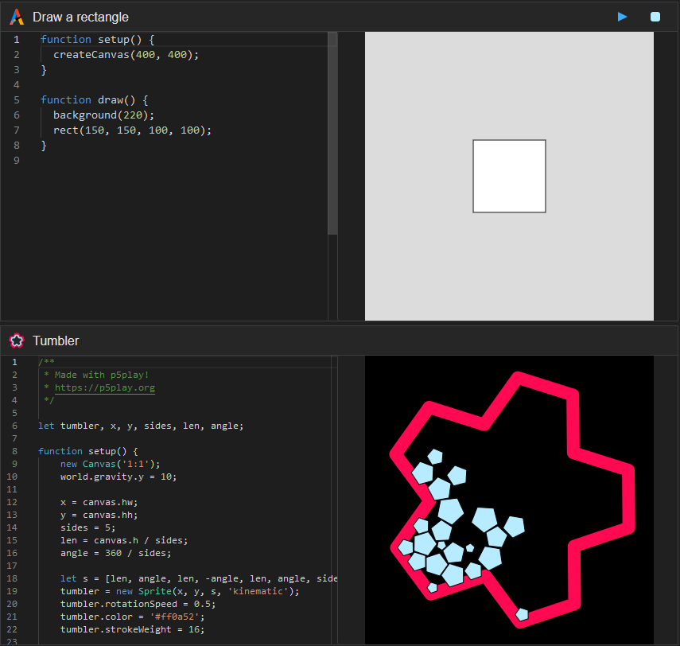
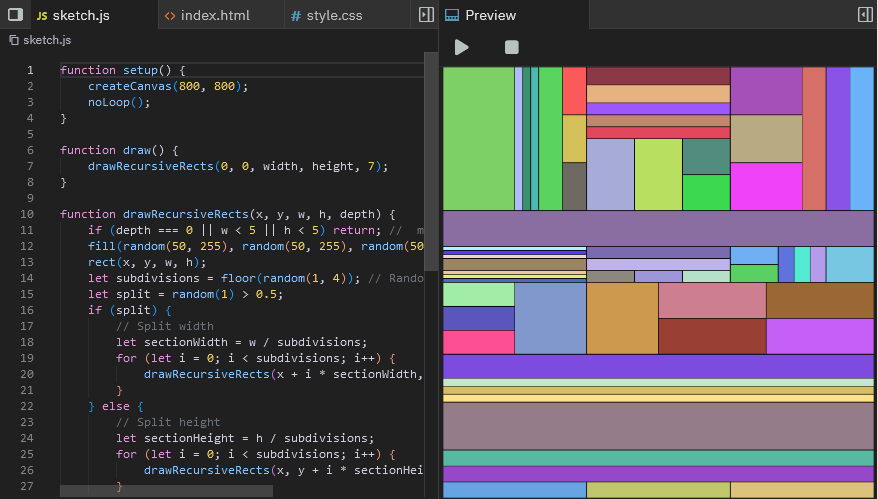

# Introduction

The Mini Editor Library is a lightweight and powerful tool for integrating code editors into your web applications. It leverages the Monaco Editor and provides an easy-to-use interface for running and managing code snippets. This README will guide you through setting up and using the Mini Editor Library with example usage and available settings.

The editor works by running a single JS file and it automatically creates the CSS and HTML. You can add/modify custom dependencies to your project, by defualt the editor use [Q5.js](https://github.com/quinton-ashley/q5.js).

##

Include the necessary CSS and JavaScript files in your HTML:

The mini editor uses monaco editor and split.js, along with mini-editor.js and mini-editor.css.

You can use these via cdn, but for production it is recomended to download mini-editor.js and mini-editor.css and include them in your project to avoid any future compatability issues.

```html
<script src="https://cdnjs.cloudflare.com/ajax/libs/split.js/1.6.2/split.min.js"></script>
<script src="https://cdnjs.cloudflare.com/ajax/libs/monaco-editor/0.33.0/min/vs/loader.min.js"></script>

<link rel="stylesheet" href="mini-editor.css">
<script src="mini-editor.js"></script>
```

Add a container for each editor you want to include:


```html
<div id="editor1" class="editor-container"></div>
<div id="editor2" class="editor-container"></div>
```
You can also add a script tag for your javascript directly within the editor container like this:

```html
<div id="editor1" class="editor-container">
<script type="text/javascript" id="script1">
    function setup() {
        createCanvas(400, 400)
    }

    function draw() {
        background(220)
        rect(150, 150, 100, 100)
    }
</script>
</div>
```

## Parameters

`containerId` (string): The ID of the HTML element where the editor will be instantiated.

`scriptId` (string): The ID of the script tag containing the initial code to be loaded into the editor, not needed for aijs projects.

`autoRun` (boolean): Automatically run the code after loading.

`autoRefresh` (boolean): Automatically refresh the output when the code changes.

`showStopButton` (boolean): Display a stop button for the editor.

`showPlayButton` (boolean): Display a play button for the editor.

`image` (string): URL of the image to be displayed on the editor, if not used no image will apear.

`title` (string): Title of the editor section, if not used no title will apear.

`dependencies` (array): List of URLs for scripts that the editor code depends on.

`aijsProject` (object): Details for integrating with an AIJS project, replaces `scriptId`.

- `userId` (string): User ID for the AIJS project.
- `projectName` (string): Name of the project.
- `fileName` (string): Name of the file in the project.

`options` (object): Configuration options for the Monaco Editor.
- `theme` (string): Theme of the editor (vs-dark or vs-light).
- `fontSize` (number): Font size of the editor text.
- `lineNumbersMinChars` (number): Minimum number of characters for line numbers.
- `glyphMargin` (boolean): Show or hide the glyph margin.
- `minimap` (object): Configuration for the minimap.

*You can use **all** monaco editor options, these are just a few examples.*

## Usage

Create an instance of MiniEditor for each editor you want to initialize. Below is an example of how to set up two editors with different configurations:

```js
document.addEventListener("DOMContentLoaded", () => {
  const editor1 = new MiniEditor({
    containerId: 'editor1',
    scriptId: 'script1',
    autoRun: true,
    autoRefresh: true,
    showStopButton: true,
    showPlayButton: true,
    image: 'https://aijs.io/images/newLogo.png',
    title: 'Draw a rectangle',
    dependencies: [
      "https://q5js.org/q5.js",
    ],
    options: {
      theme: 'vs-dark',
      fontSize: 14,
      lineNumbersMinChars: 3,
      glyphMargin: false,
      minimap: {
        enabled: false
      },
      scrollbar: {
        verticalScrollbarSize: 12,
        horizontalScrollbarSize: 12
      }
    }
  });
});
```

```js
document.addEventListener("DOMContentLoaded", () => {
  const editor2 = new MiniEditor({
    containerId: 'editor2',
    autoRun: true,
    autoRefresh: true,
    showStopButton: false,
    showPlayButton: false,
    image: 'https://p5play.org/assets/p5play_logo.svg',
    title: 'Tumbler',
    dependencies: [
      "https://q5js.org/q5.js",
      "https://p5play.org/v3/planck.min.js",
      "https://p5play.org/v3/p5play.js",
    ],
    aijsProject: {// This editor uses a javascript file from aijs.io
      userId: 'tWpjOlmRQEP73aDzO4Fp8D3txBu1',
      projectName: 'Tumbler',
      fileName: 'mySketch.js'
    },
    options: {
      theme: 'vs-dark',
      fontSize: 12,
      lineNumbersMinChars: 3,
      glyphMargin: false,
      minimap: {
        enabled: false
      }
    }
  });
});
```

# Customization

You can review [Monaco editor options](https://microsoft.github.io/monaco-editor/typedoc/variables/editor.EditorOptions.html) to further customize the text editor.


You can further adjust how the mini-editor apears by adjusting `min-editor.css`

## Other ways to embed an editor

If your looking to embed a full code editor with a file system capable of running advanced projects instead of just a single JS file, check out [AIJS Editor](https://aijs.io/) and [how to embed an AIJS project](https://aijs.io/docs#embedding--embed-editor-).



## Support

To support this project, please consider [becoming a patron](https://www.patreon.com/aijscodeeditor).